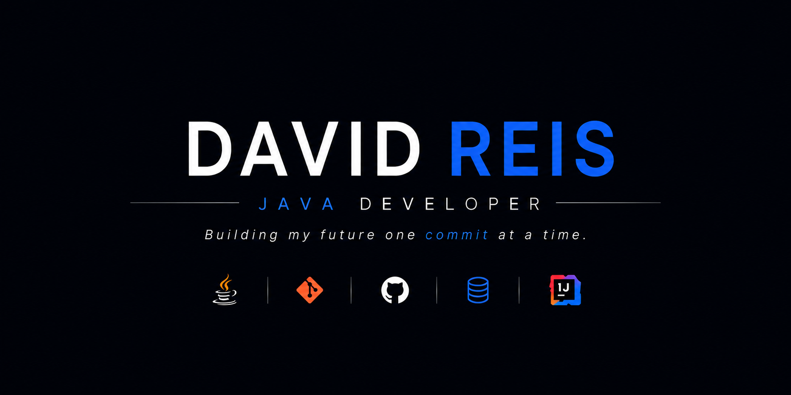

  

# 🚀 Olá, eu sou David Reis

💻 Desenvolvedor em formação | Engenharia de Software  
⚡ Focado em Java, Backend e desenvolvimento de sistemas  
🎯 Buscando estágio na área de tecnologia  

---

## 👨‍💻 Sobre mim

- 🎓 Estudante de Engenharia de Software  
- ☕ Foco em desenvolvimento backend com Java  
- 🧠 Aprendendo estrutura de dados, APIs e banco de dados  
- 🚀 Construindo projetos para portfólio  
- 🎯 Objetivo: estágio em desenvolvimento de software  

## 🛠️ Tecnologias

### 💻 Linguagens

### 🧰 Ferramentas

### 🗄️ Banco de dados

## 📊 GitHub Stats

## 🔥 Linguagens mais usadas

---

## 🔥 Atividade no GitHub

## 📫 Contato

✉️ Email: davidreiscontato27@gmail.com

## 🚀 Sobre mim

- Sempre aprendendo novas tecnologias  
- Focado em Java e backend  
- Criando projetos para portfólio  

